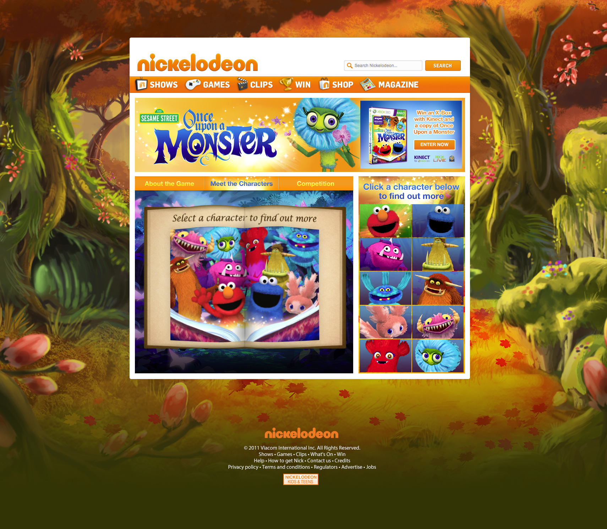

		

				

					

						Appear Here is the premier platform for renting short term retail space. 
						As part of a brand &amp; brand refresh, I design how it works pages to guide possible tenants on how it works.
					

				
 	
		

		 
 
		 	

		 		 
		 	

				

					<h2 class="w50 mAuto smallGapBott uppercase">
						Tags
					</h2>
					

						Tags are the objects viewers can interact with.  With a wide user base, I designed various tags to give our users more options to customise their interactive videos.
					

				
 			 	

		 

		 

		 	

		 		 
		 	
	
		 	

		 		 
		 	
	
		 
 

		 	

					

						USER EXPECTATIONS
					
		 		
		 		

		 			Knowing that users would interact with the scrubber to scroll through the video, I wanted to use that key functionality to indicate the interactive elements.
		 		

		 	
	
		 	

		 		 
		 	
		 	
		 	

		 		 
		 	
			 

		

				

					

						Designing games from scratch means defining logic and laws, algorythyms and animations.  
					

				
 	
				

						
				

				

					<video id="myVideo5b" class="mAuto" autoplay="" loop="">
							  <source src="assets/work/nick/thomasCookGame1.mp4" type="video/mp4">
							  <source src="mov_bbb.ogg" type="video/ogg">
							  Your browser does not support HTML5 video.
					</video>		
				

		
		 

		 

		 	

		 		 
		 	
	
		 	

		 		 
		 	
	
		 
	
		 
	

	

		
	

