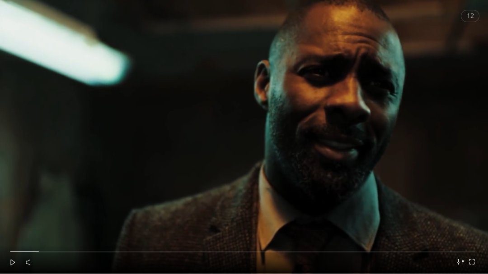

		

				

					

						Citymapper for music gigs. 
					

				
 	
		

		 
 
		 	

		 		 
		 	

				

					<h2 class="w50 mAuto smallGapBott textCenter uppercase">
						Vision
					</h2>
					

						Some friends asked me to create a vision for their new start-up.  With no real budget or time, I just went with my instincts.
					

				
 			 	

		 

		 

		 	

		 		 
		 	
	
		 	
		 	

		 		 
		 	
	
		 	

		 		 
		 	
			 	
		 
 

		 	

					

						BRANDING
					
		 		
		 		

		 			I went with a light interface for a few reasons, but chief among them (does anyone say that in real life) was gigs tend to happen at night.  Pop it like its hot.
		 		

		 	
			 

		 	

					

						FEATURE TEASE
					
		 		
		 		

		 			When looking for investment its good to think of features that might be the difference maker for possible users.  I thought a share feature would help increase users, as going to gigs is really a social activity.
		 		

		 	
	
		 	

		 		 
		 	
		 	
		 	

		 		 
		 	
			 

		

				

					

						Designing games from scratch means defining logic and laws, algorythyms and animations.  
					

				
 	
				

						
				

				

					<video id="myVideo5b" class="mAuto" autoplay="" loop="">
							  <source src="assets/work/nick/thomasCookGame1.mp4" type="video/mp4">
							  <source src="mov_bbb.ogg" type="video/ogg">
							  Your browser does not support HTML5 video.
					</video>		
				

		
		 

		 

		 	

		 		 
		 	
	
		 	

		 		 
		 	
	
		 
	
		 
	

	

		
	

